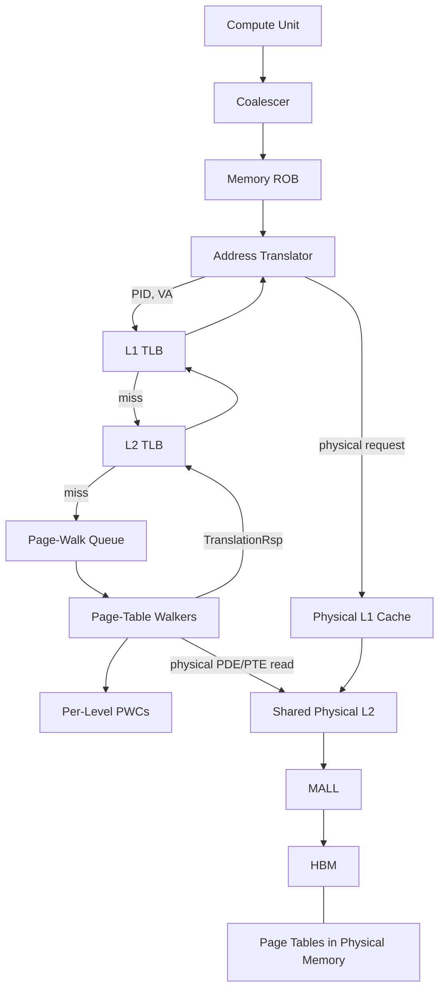
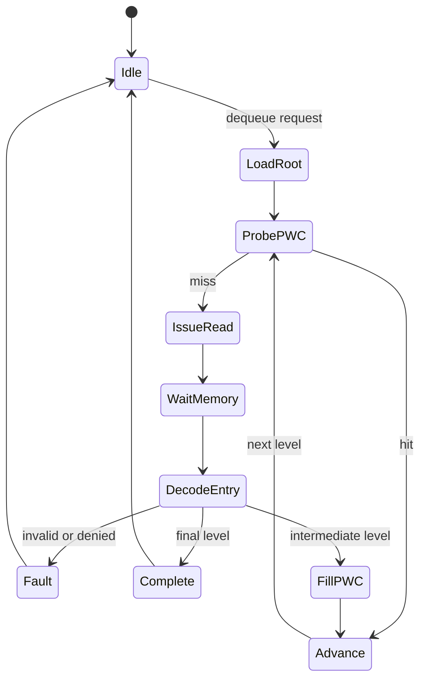

# MGPUSim Detailed GMMU and LATPC Translation Design

> **Baseline:** MGPUSim `v5.0.0-beta.1` with Akita `v5.0.0-beta.8`  
> **Target platform:** Single-GPU MI300X-class timing model, extensible to multi-GPU systems  
> **Translation baseline:** Configurable x86-64-style radix page table with 4 KiB pages

---

## 1. Overview

This document defines the detailed GPU virtual-memory model used to replace the current fixed-latency MMU lookup in MGPUSim.

The model contains:

- private L1 TLBs and a shared L2 TLB;
- a configurable multi-level radix page table stored in simulated physical memory;
- a finite page-walk queue and finite page-table walkers;
- per-level page-walk caches;
- physical PDE/PTE requests through L2, MALL, and HBM;
- TLB fill and replay of all requests waiting in TLB MSHRs;
- linear and pseudo-randomized physical-page allocation policies;
- extension points for LATC, LATP, page faults, migration, and multi-GPU translation.

The existing flat `vm.PageTable` may remain as a debug oracle, but it must not service timing translations.

---

## 2. Address-domain rules

A request may carry a virtual address only before the address translator.

```text
Virtual-address domain:
CU / coalescer / ROB
        |
        v
Address Translator -> L1 TLB -> L2 TLB -> GMMU

Physical-address domain:
L1 cache -> L2 cache -> MALL -> DRAM / RDMA
```

After translation:

$$
PA = PageBase + (VA \bmod PageSize)
$$

Required cache behavior:

- L1V, L1S, and L1I use physical addresses and physical tags.
- L2 and MALL use physical addresses and physical tags.
- PTW requests bypass CU-private L1 caches.
- PTW requests access shared L2, MALL, and HBM using physical addresses.
- TLBs cache final VPN-to-PPN translations.
- PWCs cache intermediate page-table traversal results.

The instruction path must also translate before L1I:

```text
CU -> Instruction ROB -> Instruction Address Translator
   -> L1I -> L2 -> MALL -> HBM
```

---

## 3. Top-level architecture



A normal TLB miss is resolved entirely by hardware translation. CPU or driver intervention is required only for faults or mapping changes.

---

## 4. Configurable radix page-table format

The implementation must not hard-code four separate shifts such as `39`, `30`, `21`, and `12` throughout the page-table builder or walker.

Page-table depth and per-level index widths are described by one immutable format object:

```go
type PageTableFormat struct {
    PageOffsetBits uint8
    IndexBits      []uint8 // root to leaf
    EntryBytes     uint8
    MaxLevels      uint8
}
```

### 4.1 Standard four-level x86-64 format

```go
var X86FourLevelFormat = PageTableFormat{
    PageOffsetBits: 12,
    IndexBits:      []uint8{9, 9, 9, 9},
    EntryBytes:     8,
    MaxLevels:      5,
}
```

The levels correspond to:

```text
PML4 -> PDPT -> PD -> PT
```

The virtual-address layout is:

```text
47       39 38       30 29       21 20       12 11        0
+----------+-----------+-----------+-----------+-----------+
| PML4 idx | PDPT idx  | PD idx    | PT idx    | offset    |
| 9 bits   | 9 bits    | 9 bits    | 9 bits    | 12 bits   |
+----------+-----------+-----------+-----------+-----------+
```

For this format:

$$
2^9 \times 8\text{ B} = 4096\text{ B}
$$

Thus, every page-table page contains 512 entries and occupies one 4 KiB page.

### 4.2 Five-level x86-64-style format

```go
var X86FiveLevelFormat = PageTableFormat{
    PageOffsetBits: 12,
    IndexBits:      []uint8{9, 9, 9, 9, 9},
    EntryBytes:     8,
    MaxLevels:      5,
}
```

The walker and builder must support between one and five levels without changing their state definitions.

Validation requirements:

```go
func (f PageTableFormat) Validate() error {
    levels := len(f.IndexBits)

    if levels < 1 || levels > int(f.MaxLevels) {
        return ErrInvalidLevelCount
    }
    if f.MaxLevels > 5 {
        return ErrUnsupportedLevelCount
    }
    if f.PageOffsetBits == 0 || f.EntryBytes == 0 {
        return ErrInvalidPageTableFormat
    }
    for _, bits := range f.IndexBits {
        if bits == 0 {
            return ErrInvalidIndexWidth
        }
    }
    return nil
}
```

### 4.3 Generic index extraction

```go
func ExtractIndices(
    vAddr uint64,
    format PageTableFormat,
) []uint64 {
    levels := len(format.IndexBits)
    indices := make([]uint64, levels)

    shift := uint64(format.PageOffsetBits)

    for level := levels - 1; level >= 0; level-- {
        bits := uint64(format.IndexBits[level])
        mask := (uint64(1) << bits) - 1

        indices[level] = (vAddr >> shift) & mask
        shift += bits
    }

    return indices
}
```

The implementation should avoid signed-loop underflow by using either a guarded decrement loop or a forward loop over precomputed shifts.

A safer alternative is:

```go
func ExtractIndices(
    vAddr uint64,
    format PageTableFormat,
) []uint64 {
    levels := len(format.IndexBits)
    indices := make([]uint64, levels)
    shifts := make([]uint64, levels)

    shift := uint64(format.PageOffsetBits)
    for level := levels - 1; ; level-- {
        shifts[level] = shift
        shift += uint64(format.IndexBits[level])
        if level == 0 {
            break
        }
    }

    for level, bits8 := range format.IndexBits {
        bits := uint64(bits8)
        mask := (uint64(1) << bits) - 1
        indices[level] = (vAddr >> shifts[level]) & mask
    }

    return indices
}
```

### 4.4 Generic entry-address calculation

For level `i`:

$$
EntryPAddr_i = TableBase_i + Index_i \times EntryBytes
$$

The entry at an intermediate level points to the next page-table page. The final-level entry points to the mapped physical data page.

### 4.5 Entry representation

The first implementation uses an x86-style 64-bit entry containing at least:

| Field | Required behavior |
|---|---|
| Present | Zero generates a page fault |
| Read/Write | Checked for writes |
| User | Preserved |
| Page Size | Zero for the 4 KiB baseline |
| Physical base | Next-level table page or final data page |
| No Execute | Checked for instruction translation when enabled |

Accessed and Dirty bits may be added without changing the walker interface.

---

## 5. Physical page-table placement

Each process has a CR3-like root record:

```go
type AddressSpace struct {
    PID       vm.PID
    RootPAddr uint64
}
```

Every root and intermediate table occupies a 4 KiB-aligned page in simulated physical memory.

The root lookup itself is a small GMMU control lookup:

```go
rootPAddr := addressSpaces[pid].RootPAddr
```

The timed page walk begins when the walker reads the first root-level entry.

### 5.1 Separate physical regions

Recommended layout:

```text
Low physical addresses
+----------------------------------------+
| Application data pages                |
| Data allocator grows upward           |
|                                        |
| Free physical-address region           |
|                                        |
| Page-table pages                       |
| PT allocator grows downward            |
+----------------------------------------+
High physical addresses
```

The page-table allocator must guarantee:

- page alignment;
- no overlap with data pages;
- no overlap between page-table pages;
- deterministic placement;
- placement within the intended GPU's physical-memory range.

```go
type PageTablePageAllocator interface {
    AllocateTablePage(deviceID int) uint64
    FreeTablePage(deviceID int, pAddr uint64)
}
```

---

## 6. Physical data-page allocation policies

Application data-page allocation supports two policies.

```go
type PhysicalPageAllocationPolicy interface {
    AllocatePage(deviceID int) uint64
    FreePage(deviceID int, pAddr uint64)
}
```

### 6.1 Linear policy

$$
PAddr = DeviceBase + FrameIndex \times PageSize
$$

Properties:

- contiguous or nearly contiguous physical pages;
- easy debugging;
- predictable cache, bank, and channel mapping;
- default baseline behavior.

### 6.2 Pseudo-randomized policy

$$
PhysicalFrame = Permute(LogicalFrame, Seed, NumFrames)
$$

Requirements:

- deterministic for a fixed seed;
- one-to-one within one device's frame range;
- no duplicate allocation;
- no address outside the selected GPU;
- compatible with page release and reuse.

Suitable implementations include:

- a seeded permutation of the free-frame list;
- a Feistel permutation;
- a reversible hash with cycle walking.

A repeated random draw with collision retry should not be used.

### 6.3 Sparse host backing

The simulated physical address and host storage position are decoupled.

```text
VPN
  -> page table
simulated PFN
  -> sparse Storage lookup
host storage unit
```

Akita `mem.Storage` allocates host memory only for touched units. Therefore, pseudo-randomized physical addresses spread across a large simulated HBM range do not require a dense host array covering that range.

Host memory consumption is approximately:

$$
M_{host} \approx N_{touched\ units} \times UnitSize + Metadata
$$

It is not proportional to the highest simulated physical address.

Page-table pages and data pages may share the same sparse storage while using separate physical allocators.

---

## 7. Page-table construction

The Driver builds page tables before kernel execution.

```text
AllocateMemory
  -> allocate physical data pages
  -> create missing page-table levels
  -> write PDE/PTE bytes into simulated storage
  -> launch kernel
```

Initialization writes are functional and untimed.

### 7.1 Generic mapping algorithm

```go
func (pt *RadixPageTable) MapPage(
    pid vm.PID,
    vAddr uint64,
    pAddr uint64,
    perms Permissions,
) {
    format := pt.Format
    indices := ExtractIndices(vAddr, format)
    tableAddr := pt.EnsureRoot(pid)

    for level := 0; level < len(indices)-1; level++ {
        entryAddr := tableAddr +
            indices[level]*uint64(format.EntryBytes)

        entry := pt.ReadEntryDirect(entryAddr)

        if !entry.Present() {
            child := pt.TableAllocator.
                AllocateTablePage(pt.DeviceID)

            pt.ZeroPageDirect(child)
            pt.WriteEntryDirect(
                entryAddr,
                EncodeDirectoryEntry(child, perms),
            )

            tableAddr = child
        } else {
            tableAddr = entry.PhysicalBase()
        }
    }

    leafLevel := len(indices) - 1
    leafAddr := tableAddr +
        indices[leafLevel]*uint64(format.EntryBytes)

    pt.WriteEntryDirect(
        leafAddr,
        EncodeLeafEntry(pAddr, perms),
    )
}
```

The existing flat page table may be updated in parallel and used only for validation:

```go
assert(walkResult == shadowTable.Find(pid, vAddr))
```

---

## 8. GMMU organization

### 8.1 Ports

| Port | Purpose |
|---|---|
| `Top` | Receives `TranslationReq` and returns `TranslationRsp` |
| `Memory` | Sends physical PDE/PTE reads to shared L2 |
| `Control` | Pause, drain, enable, and reset |
| `Fault` | Optional fault-service interface |

### 8.2 Main state

```go
type GMMUState struct {
    PWQ          []WalkRequest
    Walkers      []WalkerState
    MemoryReqMap map[uint64]WalkerRef
}
```

The number of walkers is a configuration constant, not a set of individually named objects.

```go
type TranslationConfig struct {
    PageTableFormat PageTableFormat
    PWQEntries      int
    NumWalkers      int
    PWCEntries      []int
}
```

### 8.3 Array-based walker state

Every walker stores state in arrays sized from the configured page-table depth.

```go
type WalkerState struct {
    Busy         bool
    Req          WalkRequest
    CurrentLevel int

    Indices        []uint64
    TablePAddrs    []uint64
    EntryPAddrs    []uint64
    DecodedEntries []uint64
    LevelCompleted []bool

    WaitingMemory    bool
    OutstandingReqID uint64
}
```

Walker initialization:

```go
func InitWalker(
    walker *WalkerState,
    req WalkRequest,
    format PageTableFormat,
) {
    levels := len(format.IndexBits)

    walker.Busy = true
    walker.Req = req
    walker.CurrentLevel = 0
    walker.Indices = ExtractIndices(req.VAddr, format)
    walker.TablePAddrs = make([]uint64, levels)
    walker.EntryPAddrs = make([]uint64, levels)
    walker.DecodedEntries = make([]uint64, levels)
    walker.LevelCompleted = make([]bool, levels)
}
```

The design must not use fields such as `PML4Addr`, `PDPTAddr`, `PDAddr`, and `PTAddr`.

### 8.4 Page-walk queue

Baseline behavior:

- 128 entries;
- FCFS scheduling;
- explicit queue-full backpressure;
- one request removed when assigned to an idle walker.

### 8.5 Walker state machine



For the active level:

```go
level := walker.CurrentLevel
index := walker.Indices[level]

entryAddr := walker.TablePAddrs[level] +
    index*uint64(format.EntryBytes)

walker.EntryPAddrs[level] = entryAddr
```

With no PWC hits, the number of physical page-table reads equals the configured number of levels.

---

## 9. Per-level page-walk caches

PWCs are stored in an array aligned with page-table levels.

```go
type GMMU struct {
    Format PageTableFormat
    PWCs   []PageWalkCache
}
```

For an `N`-level page table:

- `PWCs` contains `N-1` caches;
- the final level produces the leaf translation;
- `PWCEntries` must contain `N-1` sizes.

Example four-level baseline:

```go
pwcEntries := []int{16, 16, 16}
```

A PWC key represents:

```text
PID + virtual-address prefix consumed through this level
```

A PWC value contains:

- next-level table physical base;
- inherited permissions;
- valid state;
- replacement metadata.

A PWC hit skips the physical PDE read for that level.

---

## 10. PTW memory requests

On a PWC miss, the walker emits a physical read for the required entry:

```text
GMMU walker
  -> physical ReadReq
  -> shared L2
  -> MALL
  -> HBM
```

The logical request size is `EntryBytes`, normally 8 bytes. The cache hierarchy may fetch and retain the containing cache line.

PTW traffic uses a distinct traffic class:

```text
gmmu.pte-read
```

PTW traffic never enters L1V, L1S, or L1I.

Page-table cache lines may reside in:

- shared L2;
- MALL;
- HBM backing storage.

Upper-level translation locality is additionally captured by PWCs.

---

## 11. TLB fill and replay

### 11.1 L1 TLB miss

1. Probe L1 TLB.
2. On an MSHR hit, merge the request.
3. On a new miss, allocate an L1 MSHR.
4. Send one request to L2 TLB.
5. Stall if no MSHR or output capacity is available.

### 11.2 L2 TLB miss

1. Probe L2 TLB.
2. On an MSHR hit, merge the request.
3. On a new miss, allocate an L2 MSHR.
4. Enqueue one request in the GMMU PWQ.
5. Propagate backpressure when the MSHR or PWQ is full.

### 11.3 Completion

After the final-level entry is decoded:

1. GMMU returns `TranslationRsp`.
2. L2 TLB installs the translation and wakes its MSHR requests.
3. Requesting L1 TLBs install the translation and wake their MSHR requests.
4. Address Translators compute physical byte addresses.
5. Original requests are replayed into physical L1 caches.

The CU does not re-execute the instruction for a normal TLB miss.

---

## 12. Baseline translation configuration

```go
var LATPCBaselineTranslationConfig = TranslationConfig{
    PageTableFormat: X86FourLevelFormat,

    L1TLBEntries: 32,
    L1TLBWays:    32,
    L1TLBMSHRs:   16,
    L1TLBPorts:   4,
    L1TLBLatency: 20,

    L2TLBEntries: 1024,
    L2TLBWays:    16,
    L2TLBMSHRs:   128,
    L2TLBPorts:   16,
    L2TLBLatency: 80,

    PWQEntries: 128,
    NumWalkers: 16,
    PWCEntries: []int{16, 16, 16},
}
```

These constants reproduce the LATPC translation-pressure baseline. They are not claimed to be exact MI300X parameters.

---

## 13. Faults and invalidation

A page fault is generated when:

- a PID has no root address;
- an entry is not present;
- permissions reject the access;
- an entry is malformed;
- an unsupported page-size encoding is encountered.

Initial behavior:

```text
Page fault
  -> report PID, VA, level, entry address, and entry bits
  -> terminate the simulation
```

Later recoverable behavior may:

```text
fault
  -> driver/OS service event
  -> allocate or migrate page
  -> update PTE
  -> invalidate affected PWC and TLB entries
  -> retry translation
```

Invalidation rules:

- leaf mapping change: invalidate affected L1 and L2 TLB entries;
- intermediate pointer change: also invalidate affected PWC entries;
- process teardown: invalidate all TLB and PWC entries for the PID.

---

## 14. LATPC extensions

### 14.1 Regularity Detector

Placement:

```text
coalescer -> Regularity Detector -> L1 TLB
```

It groups related VPNs generated by one wavefront memory instruction.

### 14.2 LATC

LATC compresses related L1 TLB misses into one MSHR representation:

```text
Base VPN
Stride
Valid mask
Waiting-request metadata
```

For CDNA3 wave64, the mask is normally 64 bits or is indexed by ordered unique-VPN positions.

### 14.3 LATP

LATP groups leaf-entry accesses that share the same final-level page-table page.

For a generic format, the final-level index width is:

```go
leafIndexBits := format.IndexBits[len(format.IndexBits)-1]
```

The number of leaf entries in one final-level table page is:

$$
LeafEntries = 2^{leafIndexBits}
$$

For the standard x86-64 format, `leafIndexBits = 9`, so one PT page contains 512 entries.

LATP must not hard-code a 9-bit leaf index. Group boundaries are derived from `PageTableFormat`.

Upper levels are traversed once, followed by multiple leaf-entry accesses and multiple L2 TLB fills.

---

## 15. Required statistics

### TLB

- accesses, hits, and misses;
- MSHR hits and allocations;
- MSHR-full stalls;
- fills and evictions;
- average miss latency.

### GMMU

- PWQ occupancy and full stalls;
- queueing delay;
- walker utilization;
- walk latency;
- reads per walk;
- faults;
- response backpressure.

### PWC

Per level:

- probes;
- hits;
- misses;
- evictions;
- invalidations.

### Memory system

- PTW L2 hits and misses;
- PTW MALL hits and misses;
- PTW DRAM bytes;
- PTW memory latency;
- contention between PTW and application traffic.

### Replay and LATPC

- requests awakened per fill;
- translation-to-replay delay;
- LATC group-size distribution;
- compressed MSHR occupancy;
- LATP prefetch coverage and accuracy;
- unused prefetched translations.

---

## 16. Correctness requirements

- Every L1/L2/MALL/DRAM request uses a physical address.
- Every TLB request uses a virtual address.
- Every PTW request uses a physical PDE/PTE address.
- A completed walk matches the shadow mapping during validation.
- Page-table arrays are sized from `len(format.IndexBits)`.
- The walker contains no hard-coded four-level shifts.
- PWC count is derived from the configured number of levels.
- One `(PID, VPN)` has at most one active L2 walk after MSHR merging.
- Every waiting request is awakened exactly once.
- The byte offset is preserved during translation.
- Faulting translations do not generate application data requests.
- Drain waits for PWQ entries, walkers, memory responses, and pending translation responses.
- Linear and pseudo-randomized allocation never return the same live physical frame twice.

---

## 17. Final request flow

```text
Wavefront memory instruction
  -> coalescer
  -> address translator
  -> L1 TLB
  -> L2 TLB
  -> PWQ
  -> one page-table walker
  -> per-level PWC probes
  -> physical PDE/PTE reads through L2/MALL/HBM
  -> decode final-level PTE
  -> fill L2 TLB
  -> fill L1 TLB
  -> wake merged requests
  -> form physical byte addresses
  -> replay into physical L1 cache
```

With LATPC:

```text
Regularity Detector
  -> LATC reduces L1 TLB MSHR pressure
  -> LATP batches related leaf-entry accesses
  -> multiple translations are filled and replayed
```

The model exposes the full causal chain:

```text
page divergence
  -> TLB misses
  -> MSHR occupancy
  -> PWQ queueing
  -> PWC behavior
  -> physical page-table traffic
  -> cache and DRAM contention
  -> TLB fill
  -> request replay
  -> kernel performance
```

